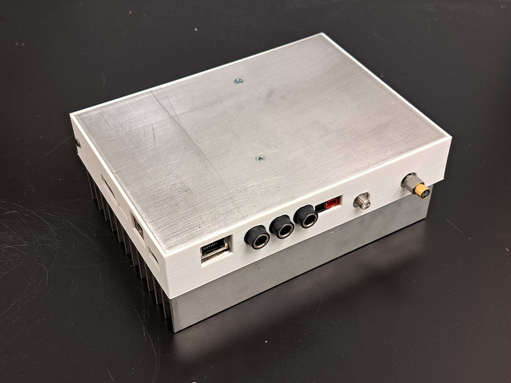
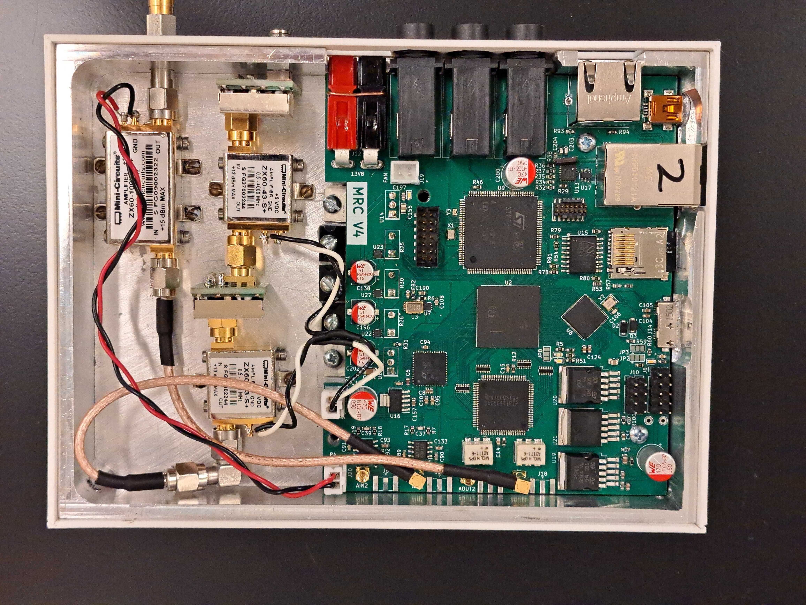
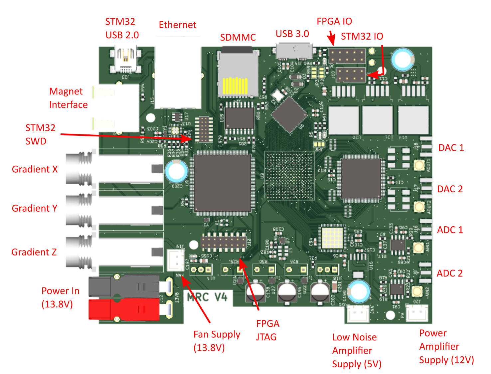
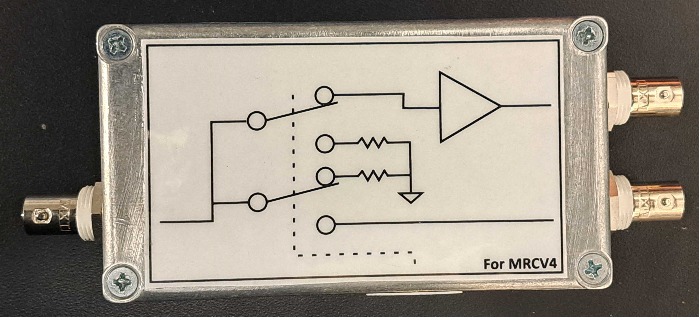
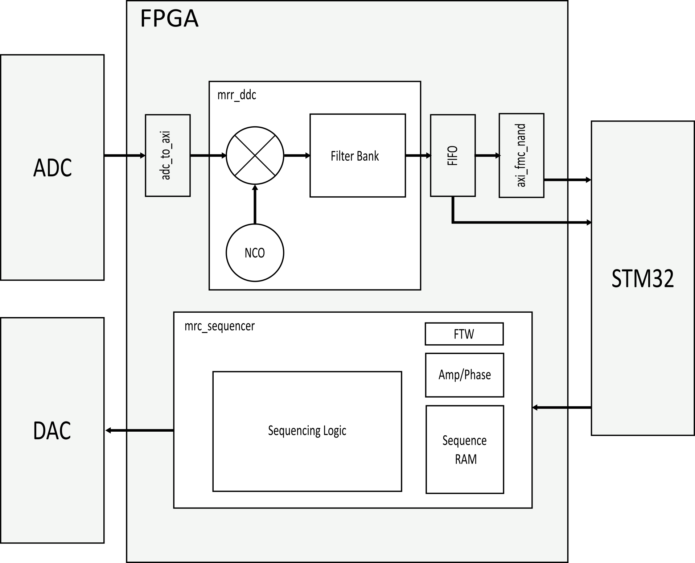
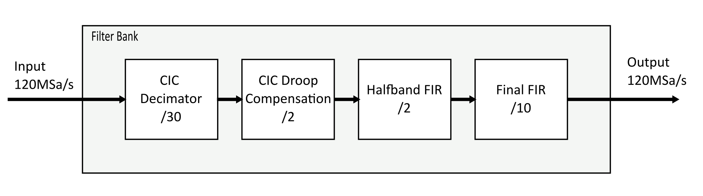
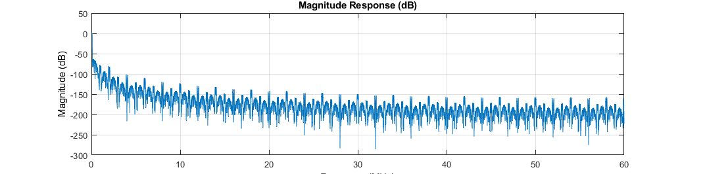
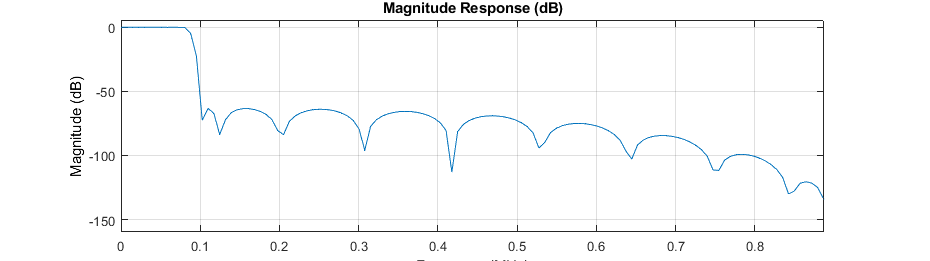

### __Quick Start:__ The [software](/software) folder contains a template Jupyter Notebook and documentation for the MRC class. 

# MR-Core
An FPGA Driven DAC + ADC for Magnetic Resonance, intended as a capable controller for Magnetic Resonance Imaging and Magnetic Resonance Relaxometry. 



### Features
- STM32F767 Microcontroller for experiment-level sequencing and backend signal processing
- Artix 7 FPGA for pulse generation, digital downconversion and DSP
- 500MSps dual oversampling DAC with on-chip NCO for RF pulse synthesis
- 120MSps dual ADC
- X, Y, and Z gradient drivers for 3A low impedance gradient coils
- 5Gbps USB-3.0 controller for raw data extraction
- 100/10 Ethernet 
- SD Card Interface
- Magnet/switch interface for temperature control and T/R switching

# User Manual

## Repository Setup and Software Prerequisites
### Required Software
- [KiCAD EDA](https://www.kicad.org/)
- [STM32CubeIDE](https://www.st.com/en/development-tools/stm32cubeide.html)
    - [STM32CubeF7 Package](https://www.st.com/en/embedded-software/stm32cubef7.html) Version 1.7.1 or 1.7.2
    - ARM CMSIS 5.4.0
- [AMD Vivado](https://www.xilinx.com/products/design-tools/vivado.html)

</br>
To set up the KiCAD Libraries:

- Open KiCAD, go to Preferences -> Configure Paths..., and add a new Environment Variable called "BioMEMS" that points to the hardware/Library folder. 
- Add the symbol library by selecting Preferences -> Manage Symbol Libraries... and selecting the BioMEMS.kicad_sym file in this folder. 
- Check that the library path shows up as "${BioMEMS}.kicad_sym". 
- Add the footprint library by selecting Preferences -> Manage Footprint Libraries... and selecting the BioMEMS.pretty folder in Library. 
- Check that the library path uses the ${BioMEMS} variable.

</br>
The STM32CubeIDE project requires similar setup:

- Create an environment variable called STM32CUBE_REPO, pointed to the STM32Cube\Repository folder on your computer.
- Restart your computer
- Open the project in STM32CubeIDE, and navigate to the IOC file
- Under "Software Packs", click "Manage Software Packs"
- Click "From URL", then "New"
- Add the URL "https://raw.githubusercontent.com/STMicroelectronics/STM32CubeF7/master/Drivers/CMSIS/ARM.CMSIS.pdsc"
- Click "OK" (several times) to add the software pack.
- You may have to close and reopen the "Manage Software Packs" window
- Click the "ARM" tab, and check "CMSIS 5.4.0"
- Click "OK" to close the window, then click "Select Components" under "Software Packs"
- Expand ARM.CMSIS, and check "CMSIS Core - 5.1.2" and "CMSIS DSP 1.5.2" 
- Click OK
- Under Middleware and Software Packs, click "CMSIS", and make sure both CMSIS Core and DSP are checked in the panel that opens
- Save the IOC and rebuild the code
- To add the STM32CubeF7 repository, extract the STM32CubeF7 to the STM32CUBE_REPO folder (next to "Packs")
- Pull the STM32Cube_FW_F7_V1.17.X folder out so it's at the same level as the Packs folder. Check that the path to this folder matches the include paths in Project->Properties (you may have to rename the folder or adjust the paths).

## Hardware Description
### Open Assembly


### PCB Connector Diagram


## Powering On
The MR-Core is designed to work with a 13.8V DC power supply, such as those sold by [Astron Corporation](https://www.astroncorp.com/). These are commonly used for amateur radio, but any linear power supply capable of providing 10A continuously is suitable. If the gradients are not used, only 3A are required. The power connector is a [ASMPR45-1X2-RK](https://www.digikey.com/en/products/detail/anderson-power-products-inc/ASMPR45-1X2-RK/13150596) from [Anderson Power Products, Inc.](https://www.andersonpower.com/us/en.html).

## Programming
### Programming the Microcontroller
- Connect an ST-Link programmer to the STM32 SWD port on the MRC. 
- Flash using STM32CubeIDE

### Programming the FPGA
- Connect an AMD compatible JTAG cable to the FPGA JTAG port on the MRC.
- Open the Hardware Manager in Vivado
- Click "Auto Connect"
- Click "Program" and select the .bit file for the FPGA

### Programming the SPI Flash
By default, new designs programmed into the FPGA must be reprogrammed every time the device loses power. To allow the FPGA image to persist between reboots, a SPI configuration flash is included that can program the FPGA with a default image on startup. To change this default image:
- Right click on create bitstream
- Click "bitstream settings"
- Check the ".bin" option
- Click Apply
- Generate the bitstream
- Click "Add Configuration Memory Device"
- If prompted, search for and select "IS25LP256"
- Right click on the device
- Click "Program"
- find .bin file in runs->impl_1 folder
- Select "Pull-Ups"
- Select the "Erase", "Program", and "Verify" options
- Select Apply, OK
- Disconnect the programming cable and restart the FPGA.

To program the SPI flash without changing the configuration (which you will want to do in most cases to update the FPGA image), the steps are more simple.
- In the Hardware Manager, right click on the SPI Flash in the Hardware window.
- Click "Program Configuration Memory Device"

## Analog Frontend (AFE)
The AFE for the MRC consists of two SXLP-21.4+ lowpass filters and two ZX60-43-S+ gain block amplifiers for the receive side, and one ZX60-100VHX+ amplifier for transmit. The amplifiers are powered by connectors from the MRC PCB, and should not be used with the heatsink removed. The transmit amplifier may be destroyed if it transmits into a poorly tuned or disconnected probe. For development, the transmit port of the MRC should be connected to a 50 ohm termination. The filters can be bypassed by soldering an 0603 resistor onto the jumpers on the filter PCBs. The MRC AFE is intended to be used with an external switch and preamplifier located on the probe - the gain blocks are not low noise amplifiers. 

## Magnet Interface
The magnet interface is connected to the MRC using an ethernet cable. The interface exposes FPGA IO for switching, as well as 3.3V power and microcontroller IO for general use. 

## Gradients
The gradients use 1/4" TRS audio connectors. Do not use 1/4" mono connectors, and do not insert or remove the connectors for the gradients when the board is powered. Doing so can damage the gradient drivers. The gradients are driven by H-bridge circuits to the supply voltage, current limited to 3A by three power resistors on the board. For this reason, neither contact for the gradients (Tip or Ring) is grounded. The Shield should not be connected to the gradient coil.

## USB 3.0
Ask Joseph Feld.

## Switch/Preamplifier Module


In order to make it possible to use non-MRC compatible probes with the MRC, a switch and preamplifier module is provided. This module provides about 10dB of gain and it includes a ZX80-DR230-S+ absorbtive RF switch. The truth table for the switch is:
| SW[1]  | SW[0] | Switch State |
| ------------- | ------------- | ----- |
| 0  | 0  | Both Off |
| 0  | 1  | Receive |
| 1  | 0  | Transmit |
| 1  | 1  | Unknown |

The yellow LED on the preamplifier module ethernet connector indicates the status of the transmit switch (on = closed) and the green LED likewise indicates the status of the receive switch.

## MRR-Core Image
This image implements a general purpose, programmable controller for MRI sequences. 

The system is programmed by the STM32 over SPI, and each SPI transaction is 16 bits with the MSB first. There are three types of SPI command: control register programming, frequency tuning word programming, and sequence programming. 

The control register is used for general purpose control of the FPGA, and can be accessed with a SPI transaction where bits [15:14] are `0b10`. The 8 LSBs give the new control register value. The control register is shown below:
**CMD (Opcode `0b00`)**
```
[  7  |  6  |  5  |  4  |  3  |  2  |  1  |  0  ]
[ RST |     |     |     |     |     |TRIG |     ]
```

To program the 16 bit frequency tuning word, the system must first be put into frequency tuning mode by sending the frequency tuning command `0xC000`. The frequency tuning word is sent on the next transaction, and the system will automatically return to IDLE afterward.

To enter sequence programming, the sequence programming command must be sent with the number of lines in the sequence program. The programming command starts with `0b00`, and the 14 LSBs are the number of 16 bit instructions in the sequence.

### MRC Instruction Set
The MRC uses a very simple instruction set designed for precise execution of any pulse sequences. There are four instructions:

**CMD (Opcode `0b00`)**
```
[ 15 | 14 | 13 | 12 | 11 | 10 |  9 |  8 |  7 |  6 |  5 |  4 |  3 |  2 |  1 |  0 ]
[  0 |  0 |   AMP   |  PHASE  |   GRX   |   GRY   |   GRZ   |      RESERVED     ]
```
Change the transmitter amplitude and phase to the values indexed by AMP and PHASE. Set the gradients to the values set by GR[xyz].

**LSET (Opcode `0b01`)**
```
[ 15 | 14 | 13 | 12 | 11 | 10 |  9 |  8 |  7 |  6 |  5 |  4 |  3 |  2 |  1 |  0 ]
[  0 |  1 | COUNTER |                          VALUE                            ]
```
Set COUNTER to VALUE.

**JMP (Opcode `0b10`)**
```
[ 15 | 14 | 13 | 12 | 11 | 10 |  9 |  8 |  7 |  6 |  5 |  4 |  3 |  2 |  1 |  0 ]
[  1 |  0 | COUNTER |                         ADDRESS                           ]
```
If COUNTER is not zero, jump to the absolute ADDRESS. If COUNTER is zero, set COUNTER to `0xFFFF` and advance the instruction counter.

**HALT (Opcode `0b11`)**
```
[ 15 | 14 | 13 | 12 | 11 | 10 |  9 |  8 |  7 |  6 |  5 |  4 |  3 |  2 |  1 |  0 ]
[  1 |  1 |                                                                     ]
```
Terminates the sequence.

To better compress the immediates for programming amplitude and phase so that all of the pulse parameters can be updated simultaneously, the AMP and PHASE fields in the CMD instruction do not directly specify the amplitude or phase, but instead give the address of the correct value within separate lookup tables that are programmed with the sequence. The first four lines of the sequence program are the four amplitude fields, and the second four lines are the four phase fields. 



### Digital Downconversion
The 120MSps data stream from the ADC is too much data for the STM32 to process, and most of this data is useless as it covers frequencies far away from the Larmor frequency of the magnet. To lower the data rate and isolate only a certain band of interest, the FPGA can digitally downconvert and downsample the ADC data stream. The digital design responsible for this is contained in the "mrr-ddc" block design within the MR-Core Vivado project. 

The structure of the DDC is shown in the HDL block diagram above. The parallel data is converted to AXI by the adc_to_axi module. This is fed into the mrr-ddc block design, which includes a complex multiplier and direct digital synthesizer for downconversion. The frequency shifted products are filtered and passed to a FIFO, before being passed to the STM32 using the STM32 Flexible Memory Controller (FMC).

The layout of the digital filter is shown below:



This filter is responsible for both decimation and the bulk of noise rejection, so the performance requirements are strict. The filter is implemented in several stages so that the high complexity FIR filters at the end see only data streams that are already significantly decimated (the final FIR filter sees an input data rate of 1MSa/s, compared to 120MSa/s for the CIC decimator).

The filter design is done in Matlab, and the current design is captured by filtdesign.m in MR-Core->hdl->Utilities. The transfer function is shown below (x axes in MHz):





## Firmware
The firmware running on the STM32 is responsible for processing or passing the data stream from the FPGA during receive, and also for configuring the FPGA, the DAC, and the ADC. The mrc STM32CubeIDE project in the "firmware" folder provides C drivers for the DAC, the ADC, and an "MRC" driver that handles communication with the FPGA, pulse sequencing, and data streaming. The DAC and ADC drivers provide access to the test patterns, power down states, and programming registers for these chips.

For USB 2.0 Full speed data streaming, the `Transfer_Buffer()` function in mrc.c will coordinate FMC reads into a ping-pong buffer that is then emptied over the USB CDC hardware into a PC. A basic serial command interface is available in this demo so that a user can trigger pulse-echo sequences by sending the command `pulseecho` over USB CDC.

## Software and UI
### Pulseq Compiler
A limited Pulseq compiler is provided in `software`. This program requires pypulseq to run, however, the latest stable release of pypulseq cannot run with the most recent versions of numpy. This can be solved by replacing every instance of `np.float` and `np.complex` in the sigpy and pypulseq libraries with `float` and `complex` respectively. 

To run the compiler, use `py mrc_pulseq_assembler.py [sequence_file.seq]` where `[sequence_file.seq]` is replaced by the path to your pulseq file. This will generate a .mrc file with the machine code for the MRI. To facilitate debugging, a objdump-style disassembler is also provided. To run the disassembler, use `py mrcdump.py [mrc_file.mrc]` where `[mrc_file.mrc]` is replaced with the path to your .mrc file. It will produce an output in the following format:

```
Statics:
Phase 0: 0
Phase 1: 0
Phase 2: 0
Phase 3: 0

Amp 0: 0
Amp 1: 28000
Amp 2: 56000
Amp 3: 0

Instructions:
0:      0001000000000000        cmd     1 0 00 00 00
1:      0100010010101111        lset    0 1199
...     ...                     ...     ...
20:     0000000000000000        cmd     0 0 00 00 00
21:     1100000000000000        halt.
```

For the system demo, a python driver for the MRC board is available in the "software" folder. bioreactormonitoring.py uses this driver to periodically acquire pulsecho sequences and plot the received data and extracted T2 values on an animated graph on the computer.


## Contributing
Best practices: make your own branch!
